# 1-図解集

[← 本文に戻る](1-人工知能の定義と技術動向・研究における問題.md)

---

## 1-1 人工知能の可能性

#### AIの分類（強いAI / 弱いAI）

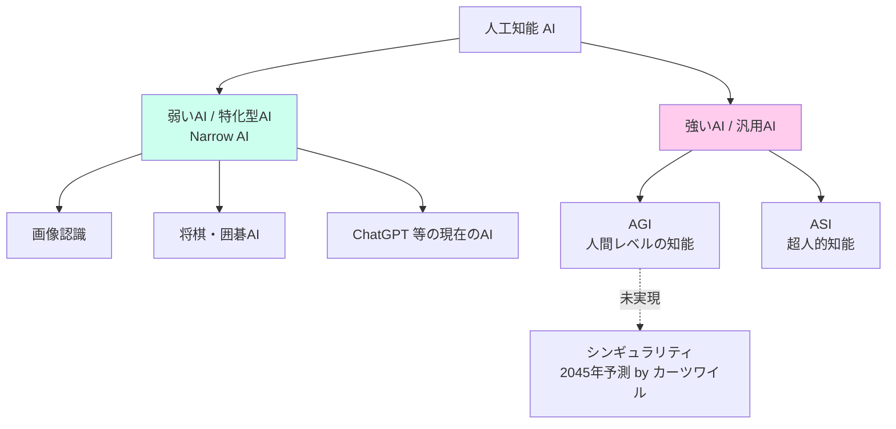

#### チューリングテスト

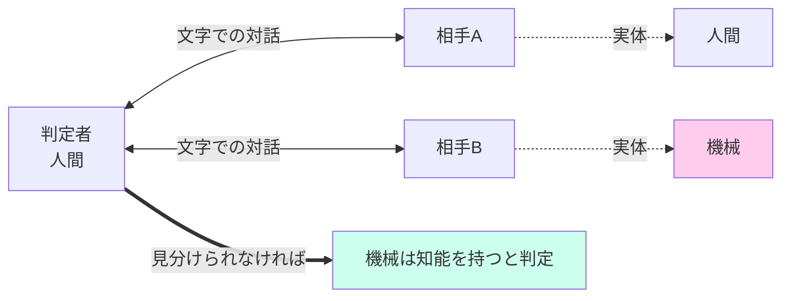

#### 中国語の部屋（サール）

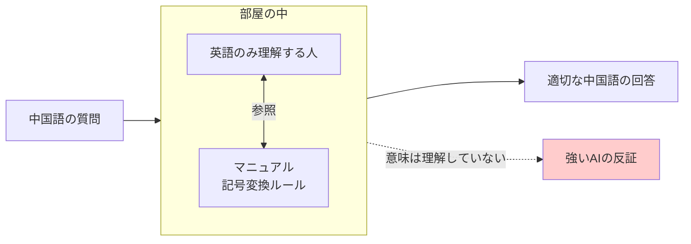

---

## 1-2 意味ネットワーク

#### 意味ネットワーク（is-a / part-of の階層）

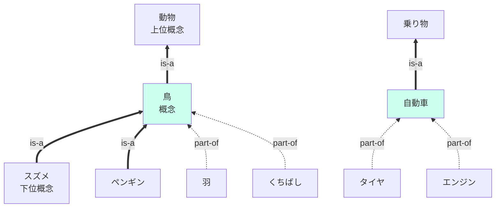

> 太い実線（==>）が **is-a**（〜の一種）、点線（-.->）が **part-of**（〜の一部）。

#### オントロジーの2系統

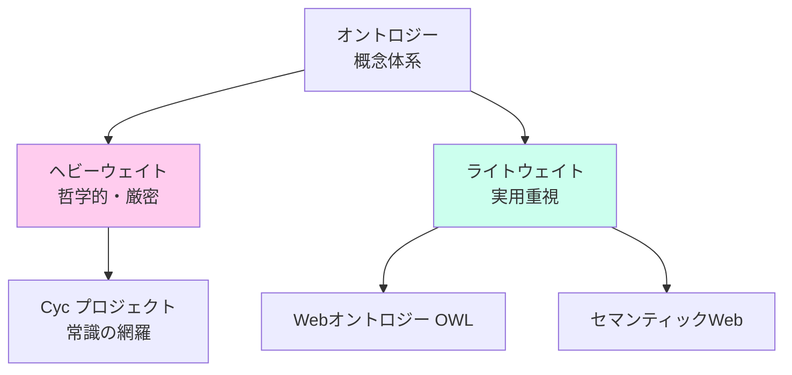

---

## 1-3 3度のAIブーム

#### 3度のAIブームと冬の時代

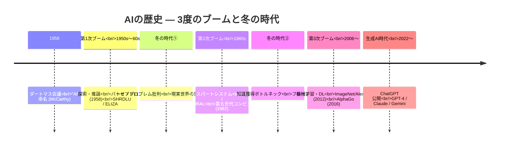

#### 3度のブームの主役技術

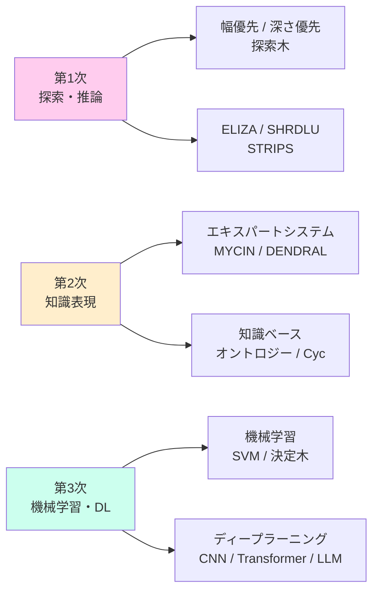

---

## 1-4 AIにまつわる問題

#### AI研究の主要問題マップ

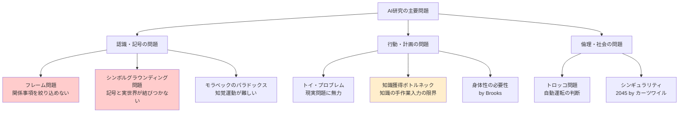

---

## 1-5 AIによる情報処理の仕組み

#### 探索木の基本構造

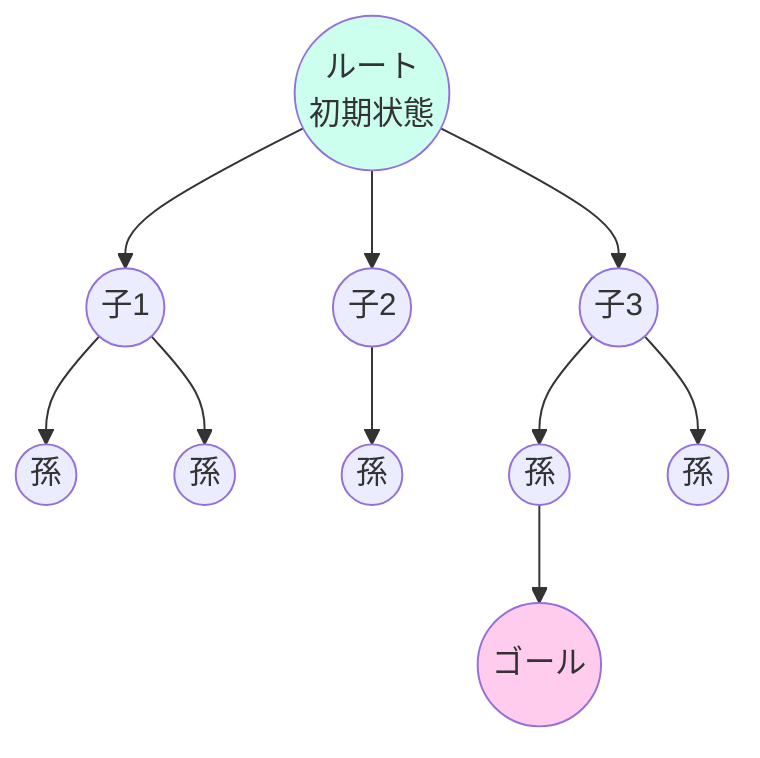

#### 幅優先探索の訪問順（横方向に層ごと）

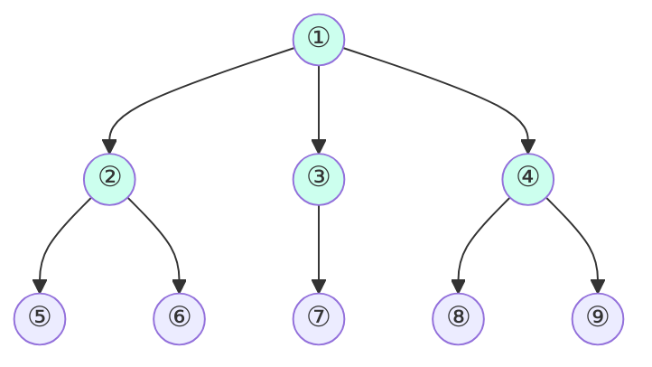

> 番号順 = 訪問順。**同じ深さを全部調べてから次の深さへ**。最短経路を必ず発見、メモリ大。

#### 深さ優先探索の訪問順（縦方向に深く）

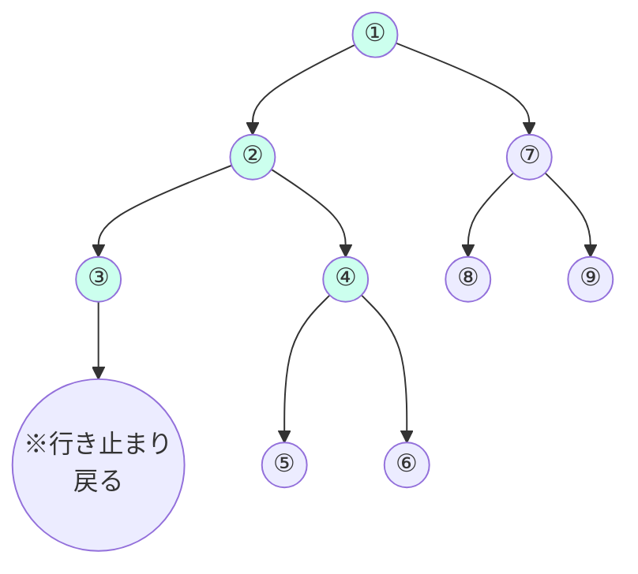

> 番号順 = 訪問順。**ある枝を行き止まりまで掘り進め**、戻って別枝へ（バックトラック）。メモリ小、最短保証なし。

#### 幅優先 vs 深さ優先の特性比較

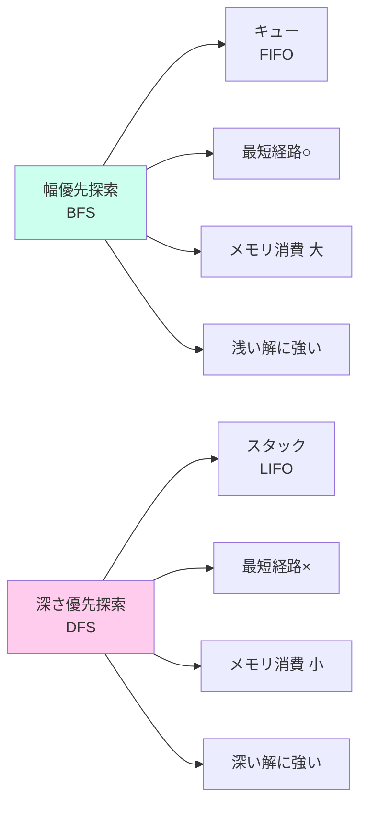
