# 2-図解集

[← 本文に戻る](2-機械学習の基本概念・具体的な手法・制度評価.md)

---

## 2-1 機械学習の主要分野の基本

#### 機械学習の分類

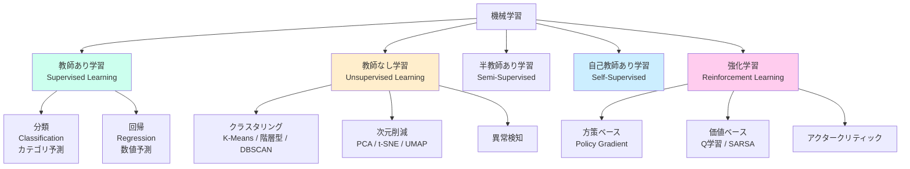

#### 強化学習の基本ループ

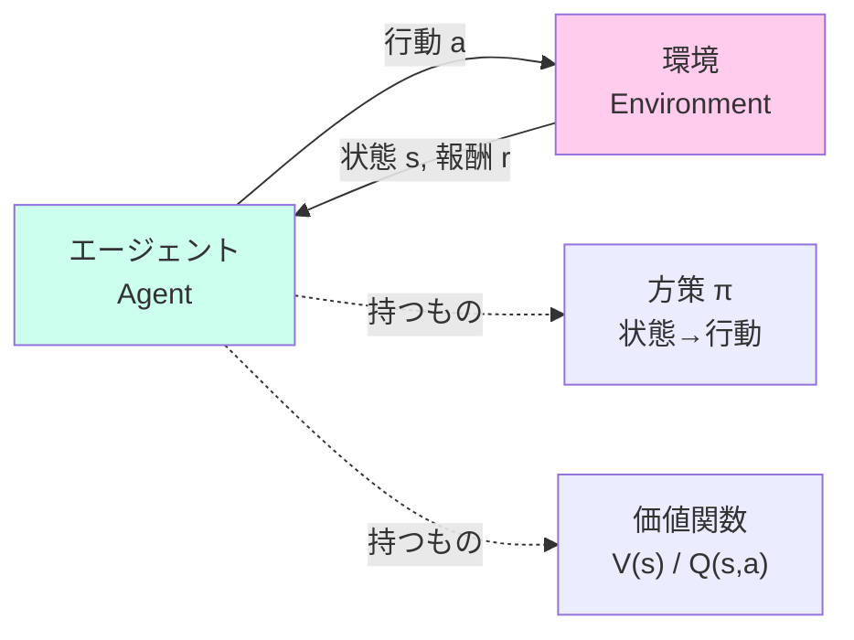

> **目的:** 累積報酬 Σγᵗ·rₜ を最大化する方策 π を学習。

#### 探索と利用のジレンマ（多腕バンディット）

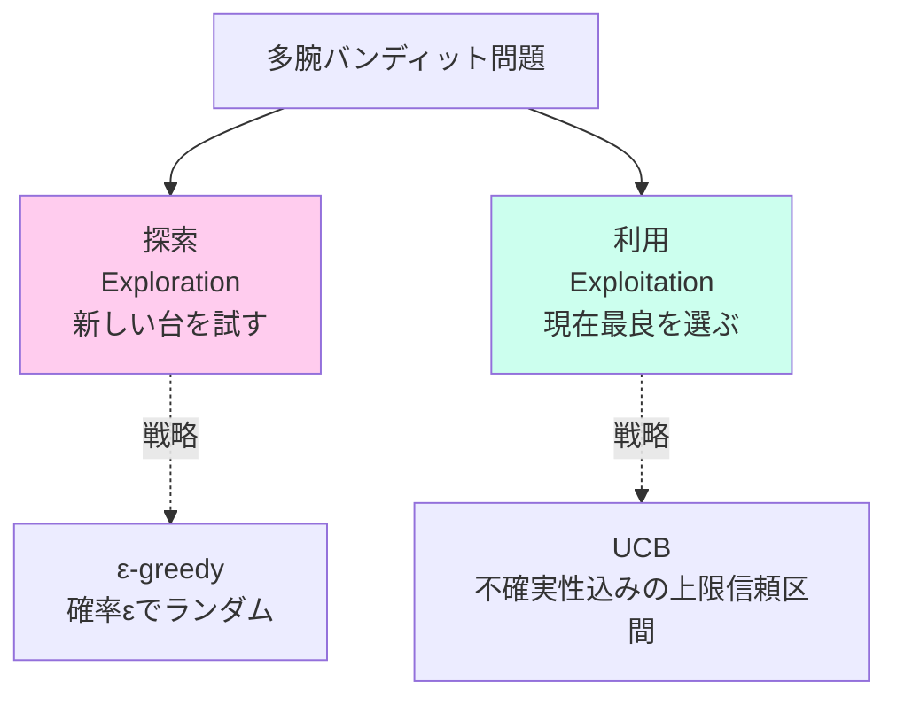

---

## 2-2 過学習と汎化性能

#### 過学習・未学習・適合のイメージ

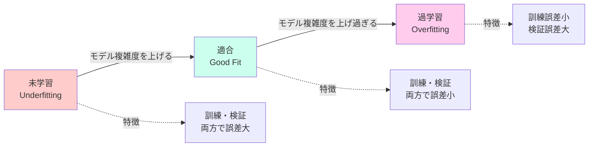

#### バイアス-バリアンスのトレードオフ

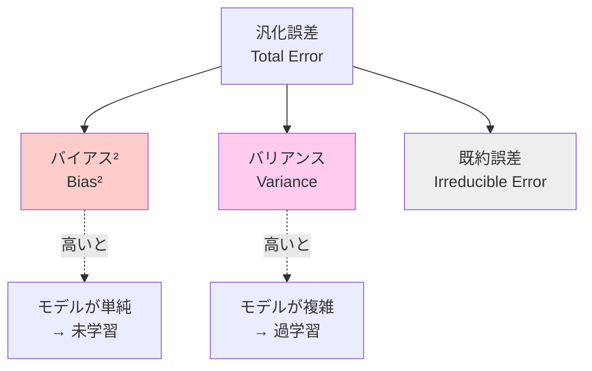

> 汎化誤差 ≈ バイアス² + バリアンス + 既約誤差

#### 正則化手法の比較

```mermaid
graph TD
    Reg[正則化<br/>Regularization]
    Reg --> L1[L1正則化<br/>Lasso]
    Reg --> L2[L2正則化<br/>Ridge]
    Reg --> EN[Elastic Net]
    Reg --> ES[早期終了<br/>Early Stopping]

    L1 -. ペナルティ .-> L1P[Σ|w|<br/>絶対値の和]
    L2 -. ペナルティ .-> L2P[Σw²<br/>二乗の和]
    EN -. ペナルティ .-> ENP[L1 + L2 の組合せ]

    L1 -. 効果 .-> L1E[疎な解<br/>特徴量選択]
    L2 -. 効果 .-> L2E[小さく滑らか<br/>過学習抑制]

    style L1 fill:#fce
    style L2 fill:#cfe
    style EN fill:#fec
```

---

## 2-3 機械学習の具体的な手法

#### 決定木の例

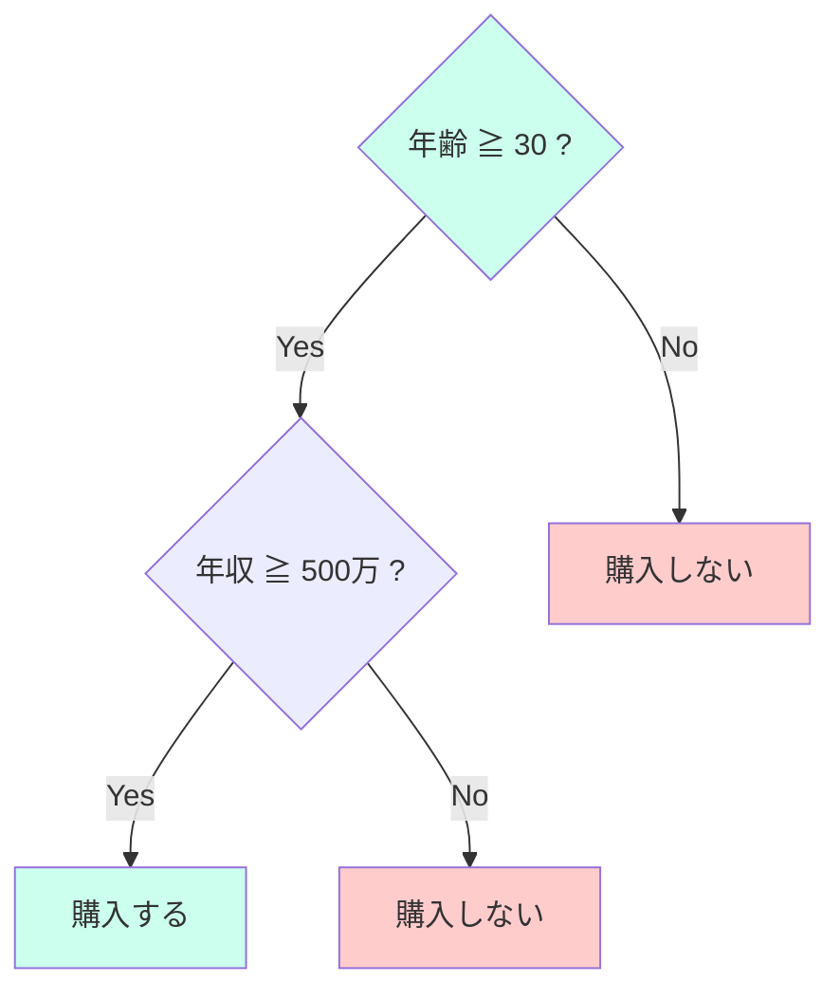

> 各内部ノードは条件分岐、葉ノードがクラス／予測値。**ジニ不純度・情報利得**で分割を選ぶ。

#### アンサンブル学習の3方式

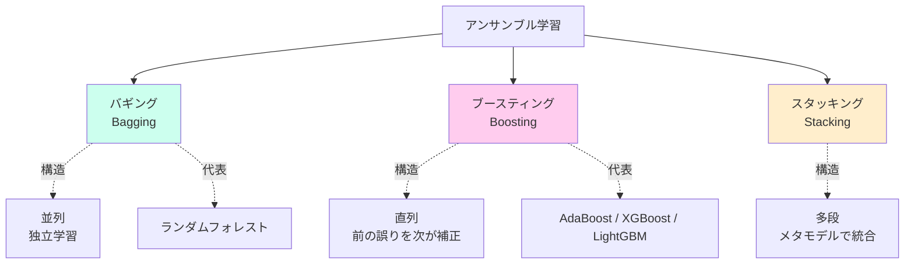

#### バギングの流れ（ランダムフォレストの仕組み）

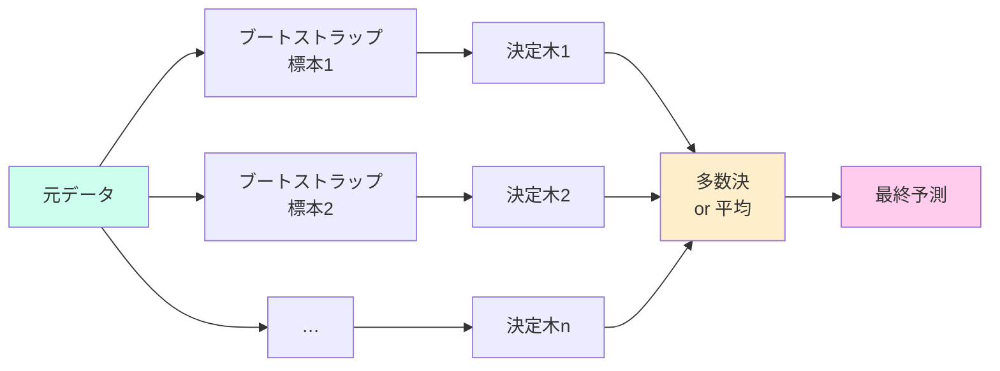

#### ブースティングの流れ


#### SVM の概念

```mermaid
graph LR
    subgraph Margin [マージン最大化]
        SV1[サポートベクトル<br/>境界に最も近い点]
        Boundary[決定境界<br/>分類超平面]
        SV2[サポートベクトル<br/>境界に最も近い点]
        SV1 <--> Boundary
        Boundary <--> SV2
    end

    Linear[線形分離不可] -->|カーネル関数で<br/>高次元に写像| HighDim[高次元空間で<br/>線形分離可能]
    HighDim -.-> Trick[カーネルトリック<br/>内積計算のみで実現]

    style Boundary fill:#cfe
    style Trick fill:#fec
```

#### クラスタリング手法の分類

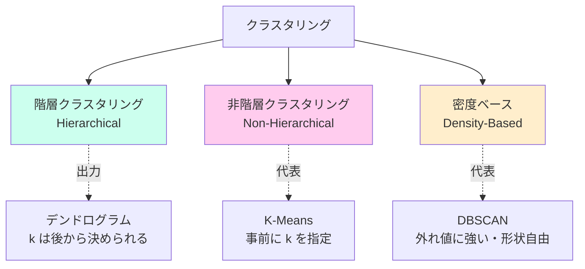

#### K-Means のアルゴリズム

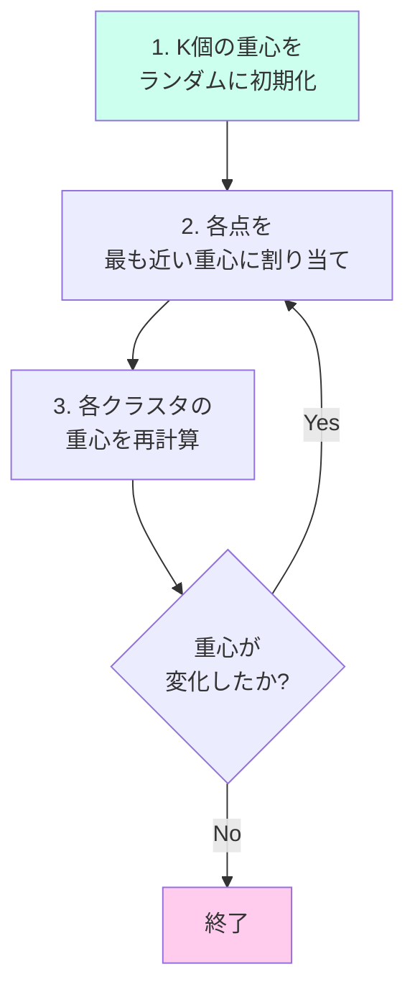

#### 次元削減手法の比較

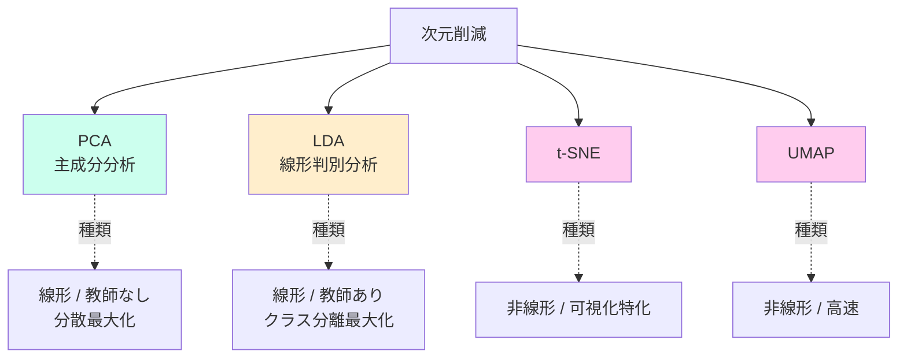

---

## 2-4 精度評価とハイパーパラメータの最適化

#### 混同行列の構造

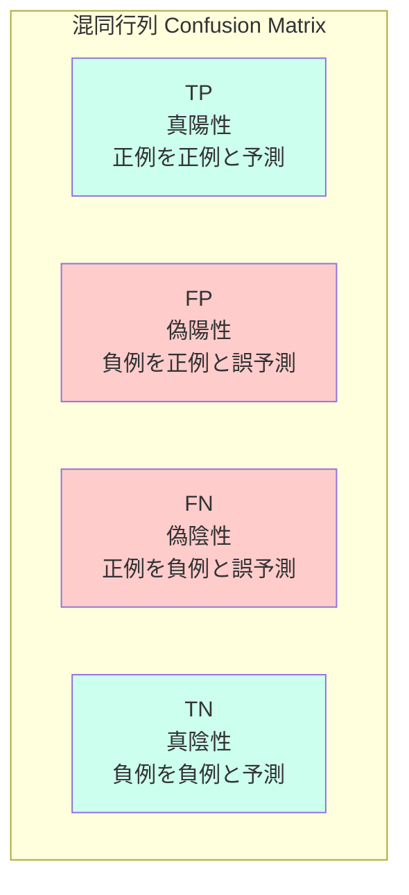

#### 適合率・再現率・特異度の関係

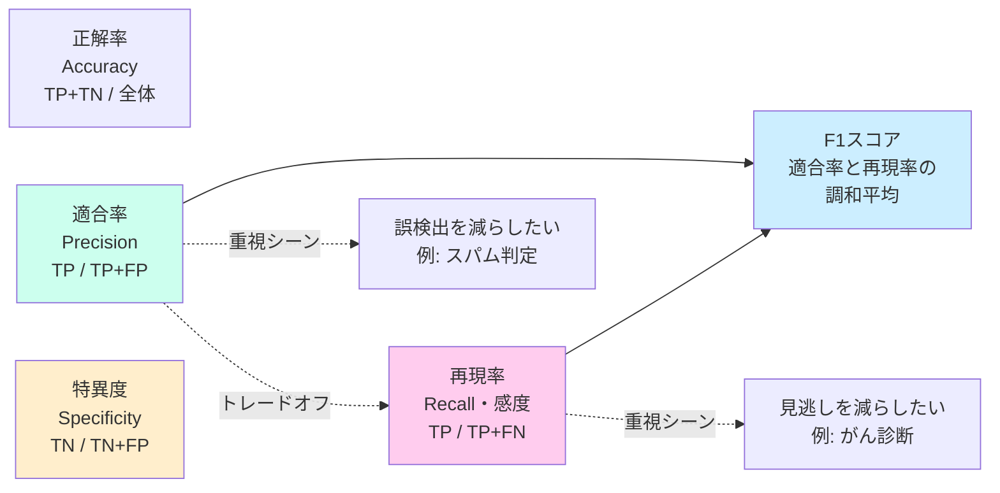

#### ROC曲線・AUCの考え方

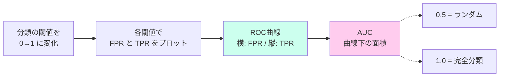

#### K-分割交差検証（K-fold CV）の流れ

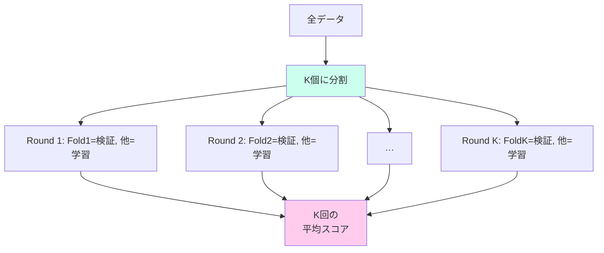

#### ハイパーパラメータ最適化の比較

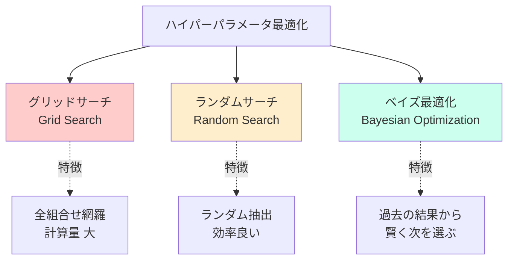

---

## 2-5 データ加工

#### データ前処理パイプライン

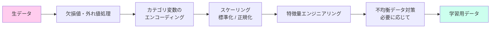

#### 標準化 vs 正規化

```mermaid
graph TD
    Scale[スケーリング]
    Scale --> Std[標準化<br/>Standardization]
    Scale --> Norm[正規化<br/>Min-Max]
    Scale --> White[白色化<br/>Whitening]

    Std -. 式 .-> StdF[「x - μ」/ σ]
    Std -. 結果 .-> StdR[平均0・分散1]

    Norm -. 式 .-> NormF[「x - min」/「max - min」]
    Norm -. 結果 .-> NormR[範囲 0〜1]

    White -. 結果 .-> WhiteR[標準化 + 無相関化]

    style Std fill:#cfe
    style Norm fill:#fce
    style White fill:#fec
```

#### カテゴリ変数のエンコーディング比較

```mermaid
graph TD
    Cat[カテゴリ変数]
    Cat --> Order{順序がある?}
    Order -->|Yes<br/>例: 小・中・大| Label[ラベルエンコーディング<br/>0, 1, 2 に変換]
    Order -->|No<br/>例: 赤・青・緑| OneHot[One-Hotエンコーディング<br/>列ごとに 0/1]

    Label -. 注意 .-> LabelW[順序のないカテゴリに<br/>使うと誤った大小関係を学習]

    style Label fill:#fec
    style OneHot fill:#cfe
    style LabelW fill:#fcc
```

#### 不均衡データ対策

```mermaid
graph TD
    Imb[不均衡データ<br/>例: 1% vs 99%]
    Imb --> Under[アンダーサンプリング<br/>多数派を削る]
    Imb --> Over[オーバーサンプリング<br/>少数派を増やす]
    Imb --> Eval[評価指標を変更<br/>F1 / PR-AUC]

    Over --> Dup[単純複製]
    Over --> SMOTE[SMOTE<br/>近傍データから<br/>合成生成]

    Under -. デメリット .-> UnderD[情報が失われる]
    Dup -. デメリット .-> DupD[過学習しやすい]

    style SMOTE fill:#cfe
    style Eval fill:#fec
```
