# 3-図解集

[← 本文に戻る](3-ディープラーニングの仕組みと応用.md)

---

## 3-1 ニューラルネットワークの学習の基本

#### ニューロンの計算モデル

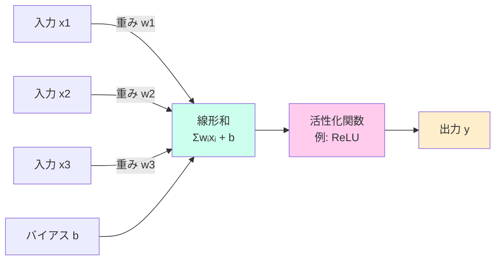

#### 単純パーセプトロン vs 多層パーセプトロン

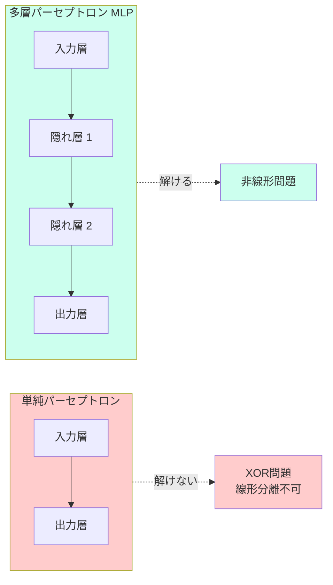

#### 活性化関数の比較

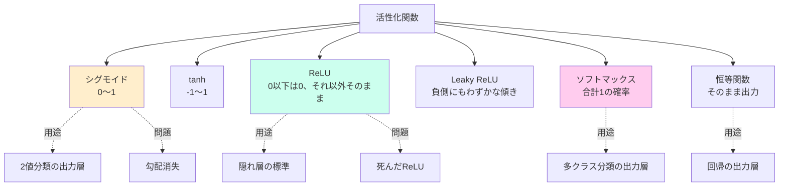

#### 誤差逆伝播法（Backpropagation）

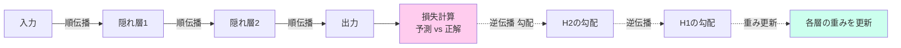

#### 重み初期化の使い分け

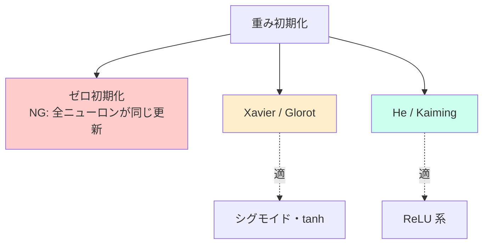

---

## 3-2 ニューラルネットワークの学習における工夫

#### 局所最適解・鞍点・プラトーの違い

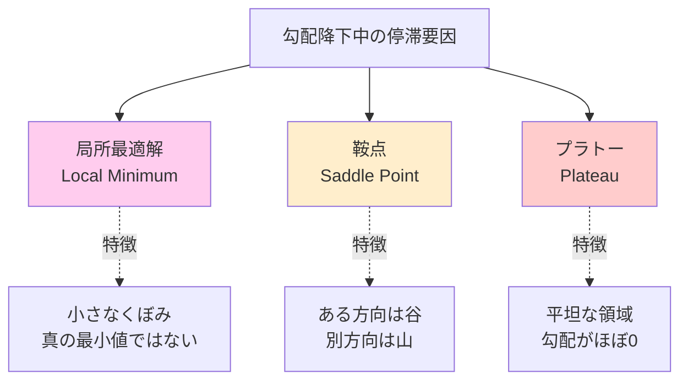

#### 勾配降下法の3種類

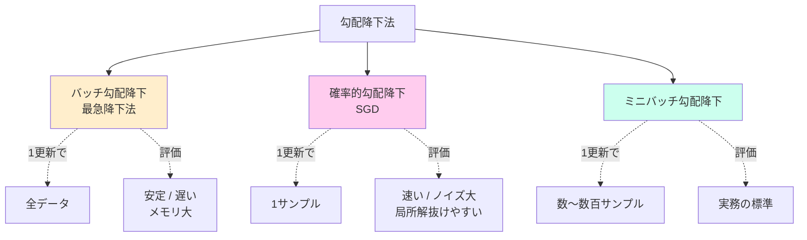

#### 最適化アルゴリズムの系譜

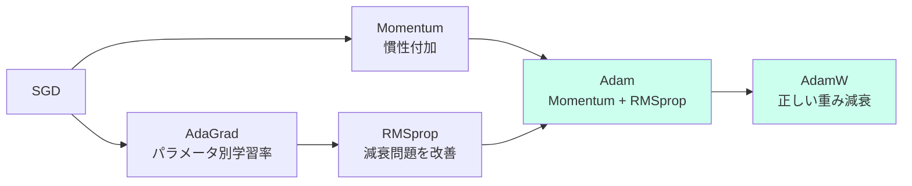

#### 転移学習 vs ファインチューニング

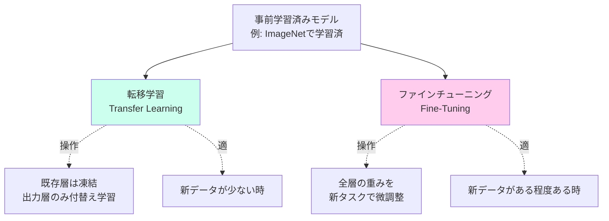

#### 正規化手法の比較

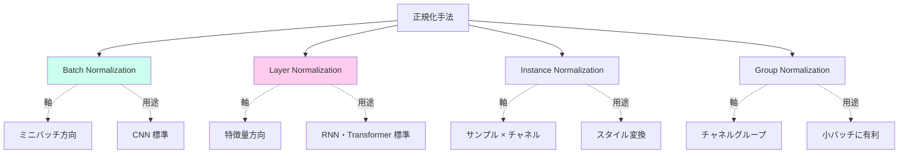

#### モデル軽量化の手段

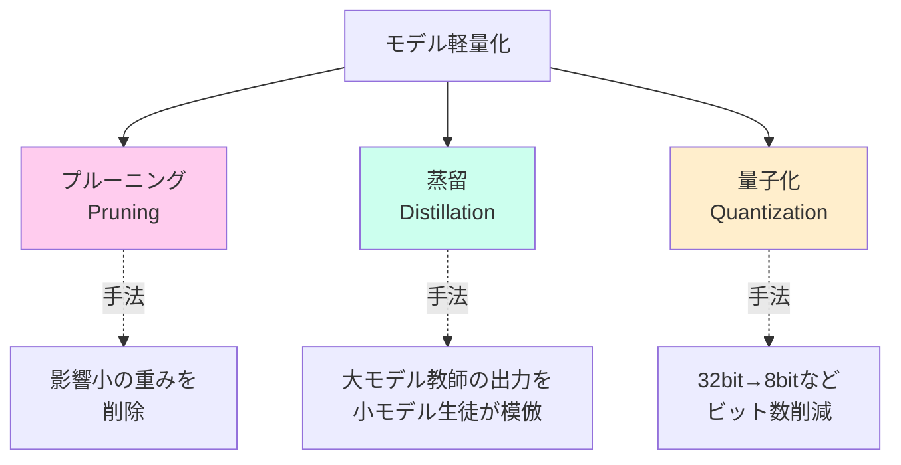

---

## 3-3 リカレントニューラルネットワーク (RNN)

#### RNN の時間展開

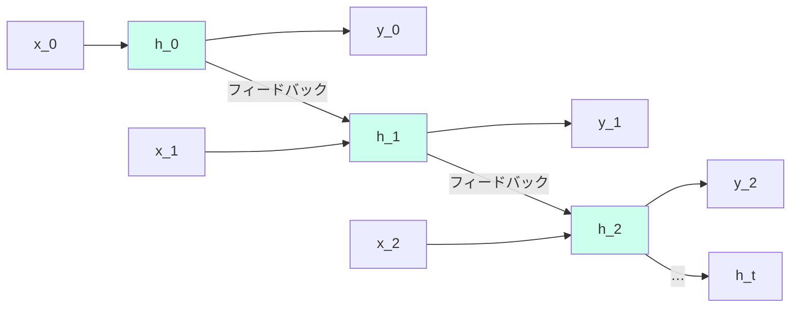

> 過去の隠れ状態 hₜ₋₁ を次の時刻に持ち越す。学習は **BPTT**（時間方向の誤差逆伝播）。

#### LSTM の内部構造

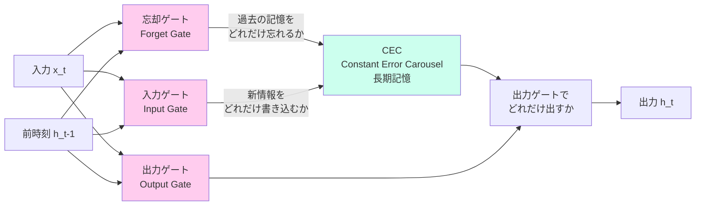

#### LSTM vs GRU

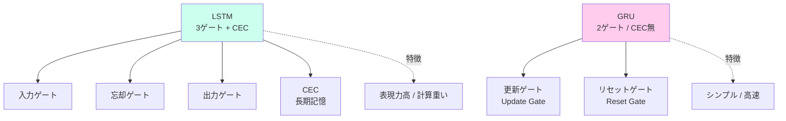

#### 双方向RNN の構造

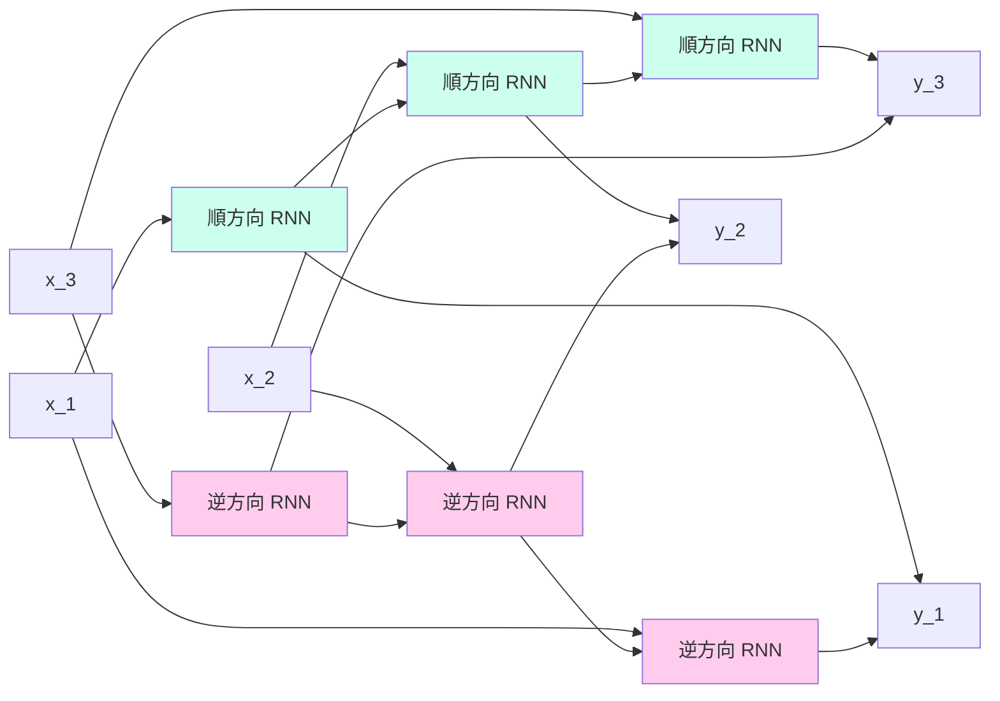

#### seq2seq の構造

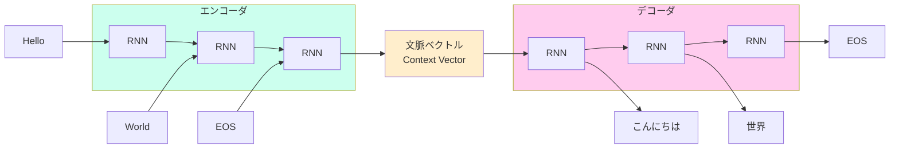

#### Attention 機構の概念

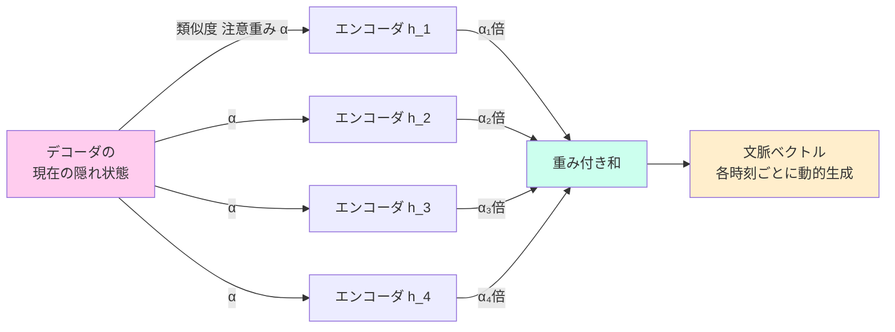

> 各デコーダ時刻でエンコーダ全位置を参照、重要な位置を**重み α** で強調。Transformer の中核。

---

## 3-4 畳み込みニューラルネットワーク (CNN)

#### CNN の基本構造

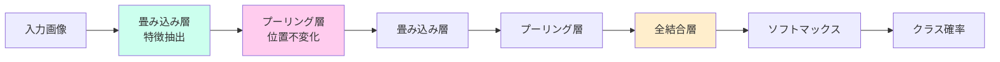

#### プーリング層の種類

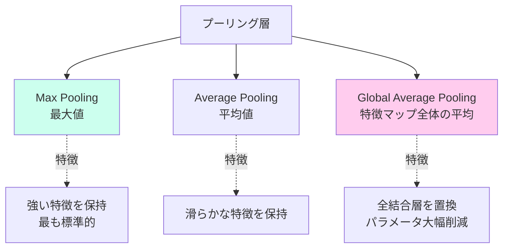

#### CNN モデル系譜

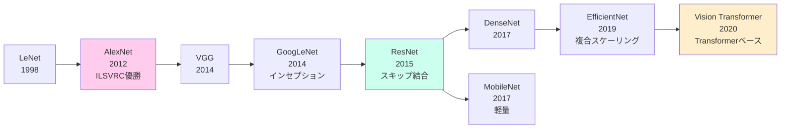

#### ResNet のスキップ結合

```mermaid
graph LR
    In[入力 x] --> L1[層 F1]
    L1 --> L2[層 F2]
    L2 --> Add((+))
    In -.->|スキップ結合<br/>恒等写像| Add
    Add --> Out[出力<br/>F2(F1(x)) + x]

    style In fill:#cfe
    style Add fill:#fce
    style Out fill:#fec
```

> 元の入力 x をそのまま足し戻す（**残差**を学ぶ）。**超深層でも勾配消失せず**、152層を実現。

---

## 3-5 深層強化学習

#### 強化学習の基本フレームワーク

```mermaid
graph LR
    Agent[エージェント]
    Env[環境]

    Agent -->|行動 a_t| Env
    Env -->|状態 s_t+1<br/>報酬 r_t+1| Agent

    Agent -.内部.-> Pol[方策 π<br/>状態→行動]
    Agent -.内部.-> V[価値関数<br/>Q s,a]

    style Agent fill:#cfe
    style Env fill:#fce
```

#### 価値ベース vs 方策ベース

```mermaid
graph TD
    RL[強化学習アルゴリズム]
    RL --> Val[価値ベース]
    RL --> Pol[方策ベース]
    RL --> AC[アクタークリティック]

    Val --> Q[Q学習<br/>方策オフ型]
    Val --> SARSA[SARSA<br/>方策オン型]
    Val --> DQN[DQN]

    Pol --> RE[REINFORCE]
    Pol --> PG[方策勾配法]

    AC --> A3C[A3C / A2C]
    AC --> PPO[PPO<br/>RLHFで使用]
    AC --> TRPO[TRPO]
    AC --> DDPG[DDPG / SAC<br/>連続行動]

    style DQN fill:#cfe
    style PPO fill:#fce
    style AC fill:#fec
```

#### DQN の発展系

```mermaid
graph LR
    DQN[DQN<br/>2013/2015]
    DQN --> DDQN[Double DQN<br/>過大評価抑制]
    DQN --> Duel[Dueling DQN<br/>V s と A s,a を分離]
    DDQN --> Rain[Rainbow<br/>6改良統合]
    Duel --> Rain
    DQN --> NoisyN[NoisyNet<br/>探索強化]
    NoisyN --> Rain
    DQN --> ER[Experience Replay<br/>経験再生]

    style DQN fill:#cfe
    style Rain fill:#fce
```

#### AlphaGo 系の系譜

```mermaid
graph LR
    AlphaGo[AlphaGo<br/>2016<br/>イ・セドルに勝利<br/>棋譜+自己対局]
    AlphaGoZ[AlphaGo Zero<br/>2017<br/>完全自己対局のみ]
    AlphaZ[AlphaZero<br/>2017<br/>囲碁・将棋・チェス汎用化]
    AlphaSt[AlphaStar<br/>2019<br/>StarCraft II]
    AlphaF[AlphaFold<br/>タンパク質構造予測<br/>ノーベル化学賞2024]

    AlphaGo --> AlphaGoZ --> AlphaZ
    AlphaZ -.発展.-> AlphaSt
    AlphaZ -.発展.-> AlphaF

    style AlphaGo fill:#cfe
    style AlphaF fill:#fce
```

---

## 3-6 オートエンコーダとその応用

#### オートエンコーダの基本構造

```mermaid
graph LR
    In[入力 x] --> Enc[エンコーダ]
    Enc --> Z[潜在変数 z<br/>低次元]
    Z --> Dec[デコーダ]
    Dec --> Out[出力 x'<br/>≈ 入力]

    Out -.比較.-> In
    InOut[再構成誤差を最小化]

    style Z fill:#cfe
    style In fill:#fce
    style Out fill:#fce
```

#### AE 系列の発展

```mermaid
graph TD
    AE[オートエンコーダ AE<br/>Hinton 2006]
    AE --> SAE[積層AE<br/>事前学習で活用]
    AE --> DAE[ノイズ除去AE<br/>Denoising AE]
    AE --> Sparse[スパースAE]
    AE --> VAE[VAE 変分AE<br/>2014 Kingma]

    SAE -. 用途 .-> SAEu[DLブーム再起動の鍵]
    DAE -. 用途 .-> DAEu[ロバストな特徴学習]
    VAE -. 用途 .-> VAEu[生成モデル<br/>潜在変数を確率分布化]

    style AE fill:#cfe
    style VAE fill:#fce
```

#### Hinton の DLブーム再起動（2006）

```mermaid
graph LR
    Pre[2006以前<br/>勾配消失で<br/>深層化困難]
    Pre --> Hinton[Hinton 2006<br/>RBM/DBNと<br/>事前学習]
    Hinton --> AlexNet2[AlexNet 2012<br/>ILSVRC圧勝<br/>第3次AIブーム決定打]

    style Pre fill:#fcc
    style Hinton fill:#cfe
    style AlexNet2 fill:#fce
```

#### AE / VAE / GAN / 拡散モデルの位置づけ

```mermaid
graph TD
    Gen[生成モデル系列]
    Gen --> AE2[AE<br/>次元圧縮中心]
    Gen --> VAE2[VAE<br/>潜在変数を分布化]
    Gen --> GAN[GAN<br/>敵対的学習]
    Gen --> Diff[拡散モデル<br/>ノイズ除去過程]

    AE2 -. 生成能力 .-> A1[× 主に圧縮]
    VAE2 -. 生成能力 .-> V1[○ ぼやけがち]
    GAN -. 生成能力 .-> G1[◎ 不安定]
    Diff -. 生成能力 .-> D1[◎◎ 高品質]

    style VAE2 fill:#cfe
    style Diff fill:#fce
```

> 詳細は [9-生成AI・基盤モデル特集](9-生成AI・基盤モデル特集.md) と [10-混同しやすい用語の対比表](10-混同しやすい用語の対比表.md) 参照。

---

## ハードウェア・基盤

#### CPU / GPU / TPU / FPGA / ASIC の位置づけ

```mermaid
graph TD
    Comp[計算処理装置]
    Comp --> CPU[CPU<br/>汎用・条件分岐強い]
    Comp --> GPU[GPU<br/>並列計算特化]
    Comp --> TPU[TPU<br/>テンソル演算特化]
    Comp --> FPGA[FPGA<br/>書換可能回路]
    Comp --> ASIC[ASIC<br/>特定用途特化]

    GPU -. メーカー .-> NV[NVIDIA<br/>CUDA]
    TPU -. メーカー .-> Goog[Google]
    TPU -. 種類 .-> AS[ASIC の一種]

    style GPU fill:#cfe
    style TPU fill:#fce
```

#### 主要DLフレームワーク

```mermaid
graph TD
    FW[DLフレームワーク]
    FW --> TF[TensorFlow<br/>Google]
    FW --> PT[PyTorch<br/>Meta]
    FW --> Keras[Keras<br/>TF統合 高レベルAPI]
    FW --> JAX[JAX<br/>Google 関数型]

    TF -. 強み .-> TFs[本番展開・モバイル]
    PT -. 強み .-> PTs[研究・動的グラフ]

    style PT fill:#cfe
    style TF fill:#fce
```
