# 4-図解集

[← 本文に戻る](4-ディープラーニングの研究分野.md)

---

## 4-1 一般物体認識とその応用

#### 画像認識タスクの全体像

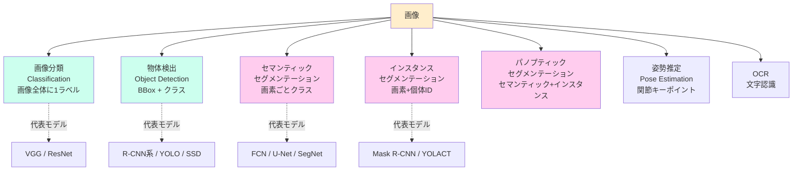

#### 物体検出の系譜（Two-Stage vs One-Stage）

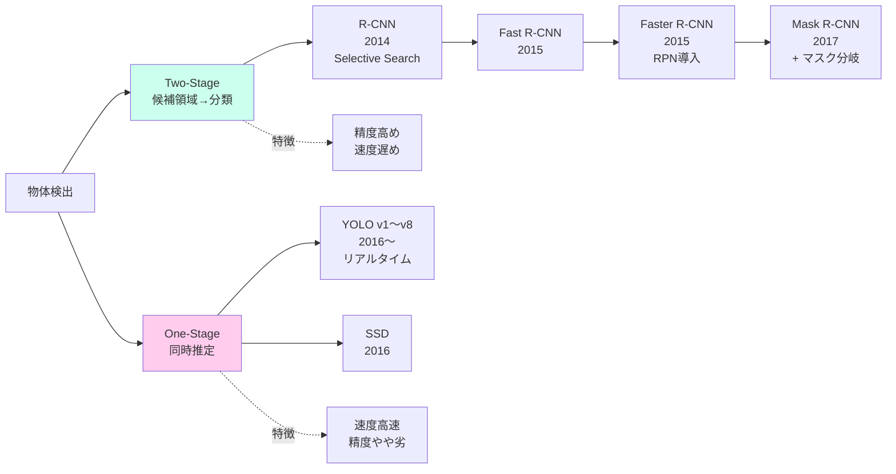

#### IoU と NMS の関係

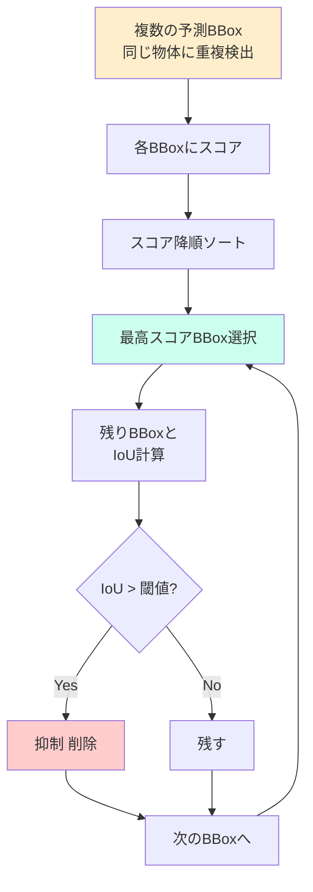

#### セマンティック・セグメンテーション系の系譜

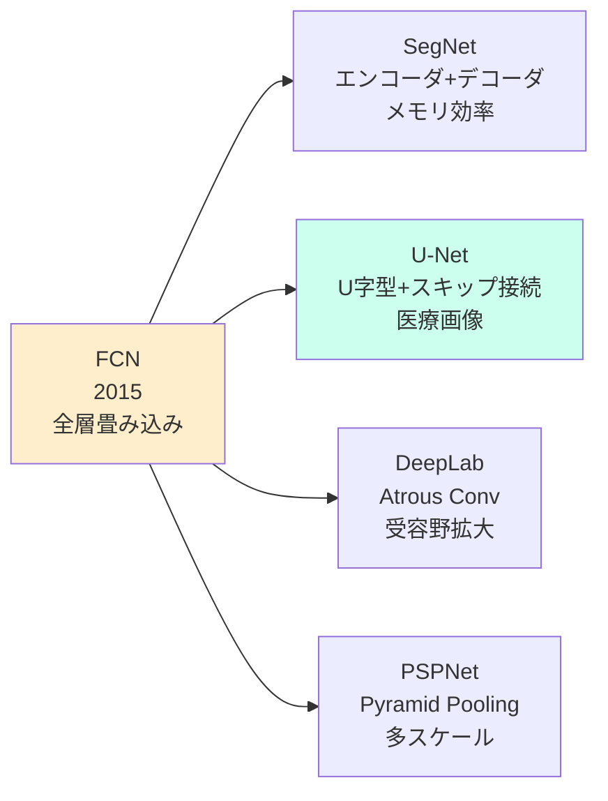

---

## 4-2 自然言語処理

#### NLPの処理パイプライン（古典→深層）

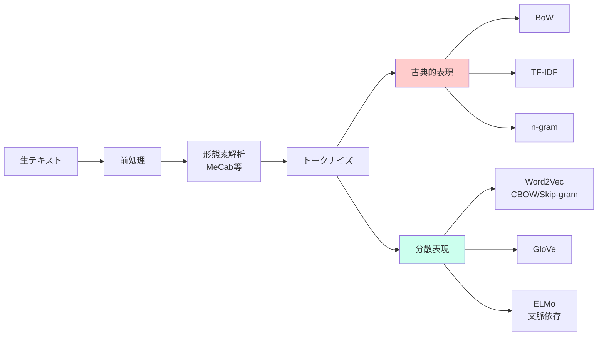

#### Transformer の構造（簡略）

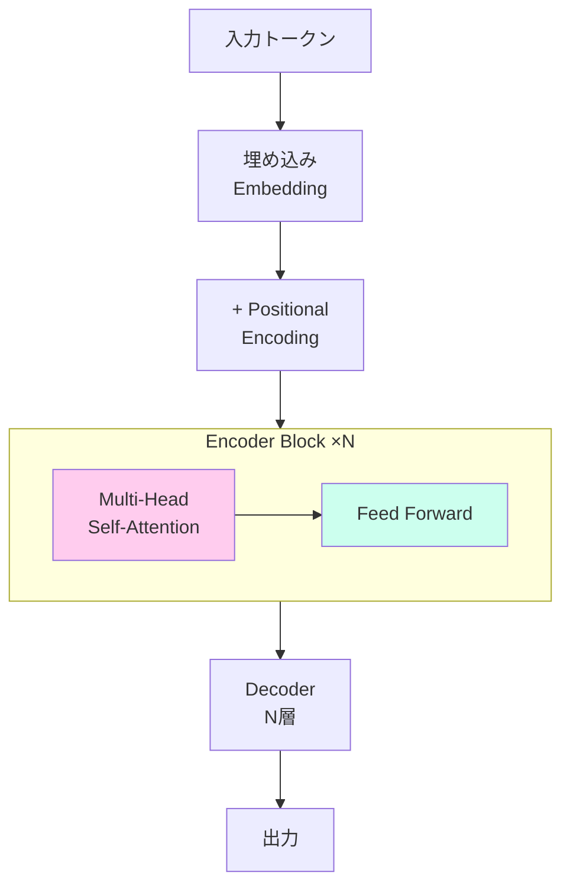

#### Self-Attention の概念

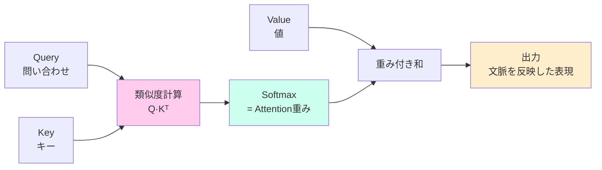

#### Transformer の3系統と代表モデル

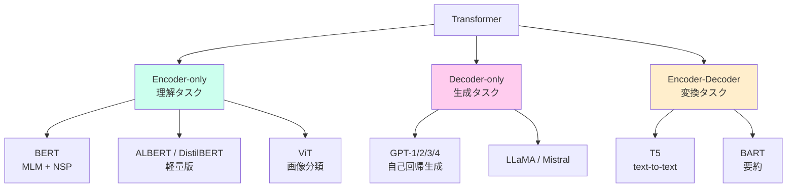

#### 推論時パラダイム（Zero/One/Few-shot）

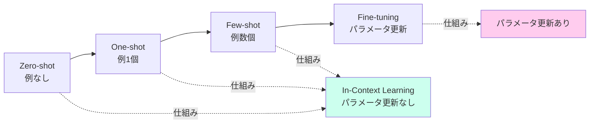

---

## 4-3 音声認識・音声生成

#### A-D変換の流れ

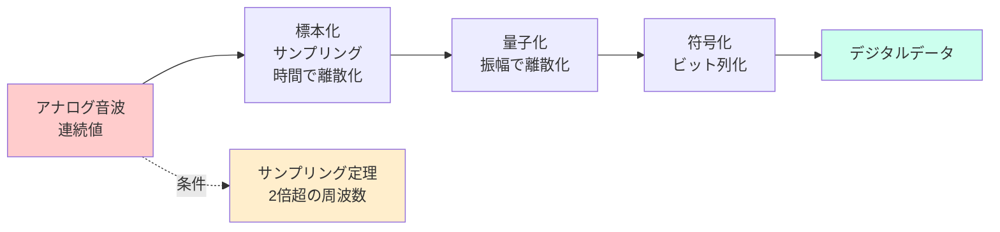

#### 古典的 ASR（音響モデル+言語モデル+辞書）

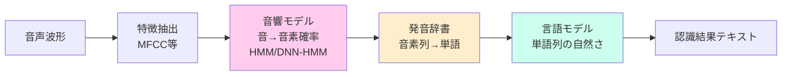

#### End-to-End ASR への発展

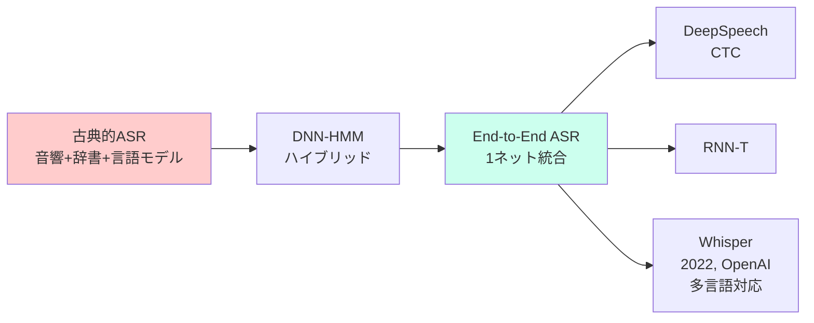

#### TTS の系譜

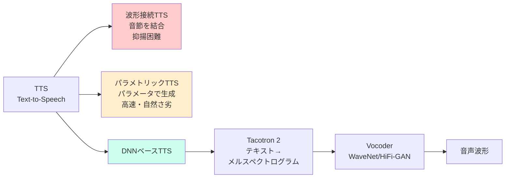

---

## 4-4 生成AIの仕組みと応用

#### 生成モデルの3系統

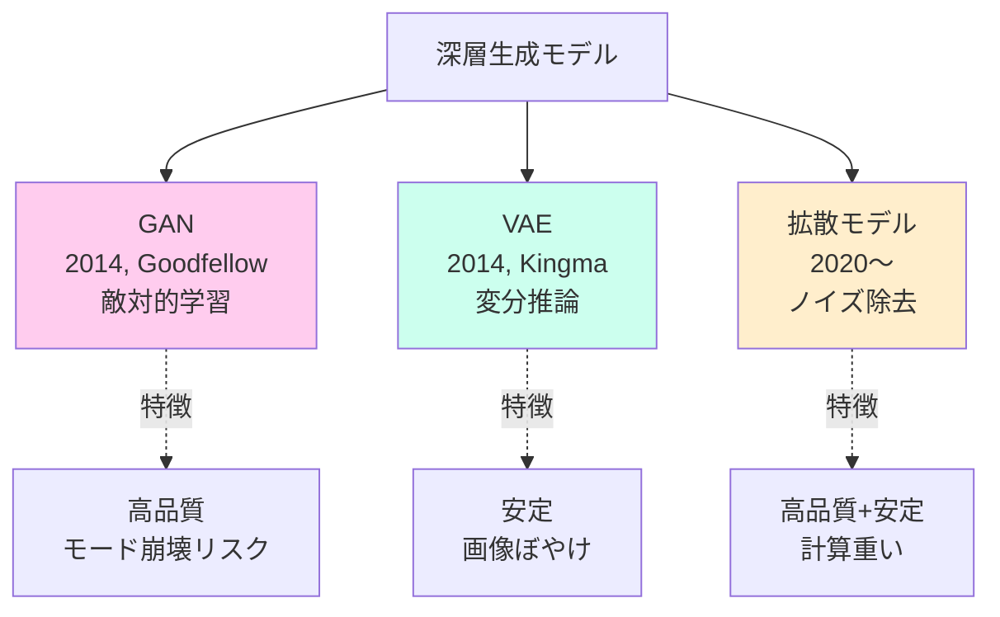

#### GAN の学習構造

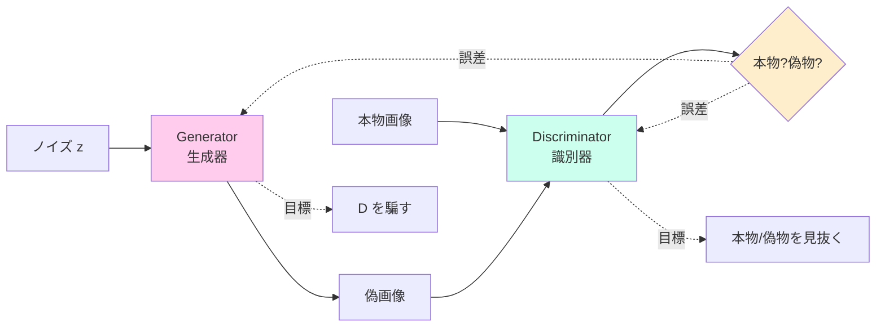

#### 拡散モデルの順過程・逆過程

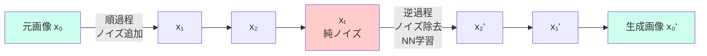

#### 主要画像生成モデル系譜

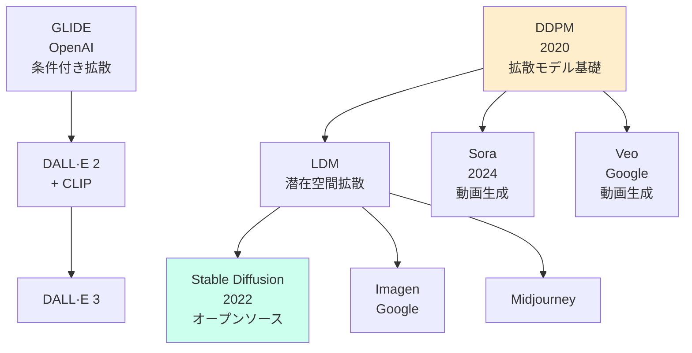

#### RLHF の3ステップ（ChatGPT 仕上げ）

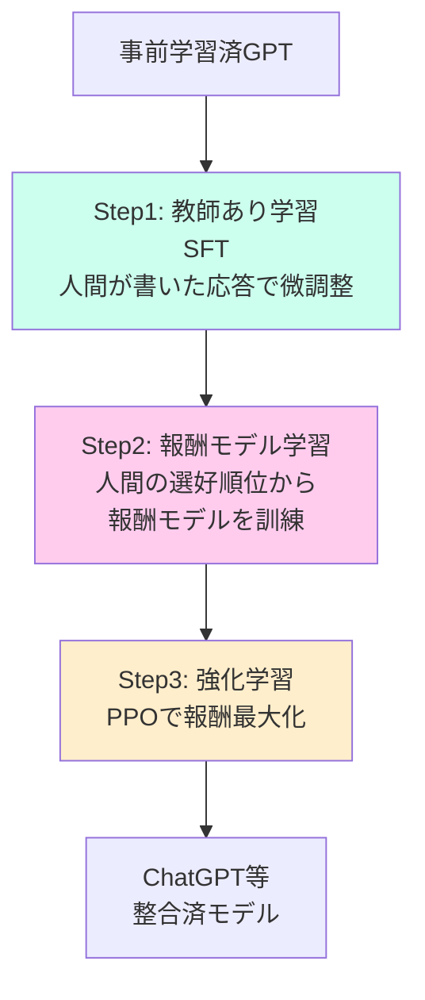

---

## 4-5 深層強化学習

#### 強化学習アルゴリズムの分類軸

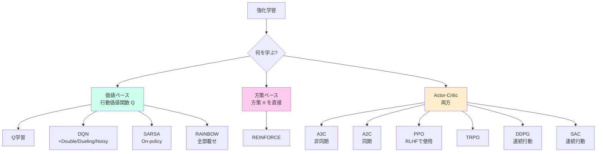

#### On-policy vs Off-policy

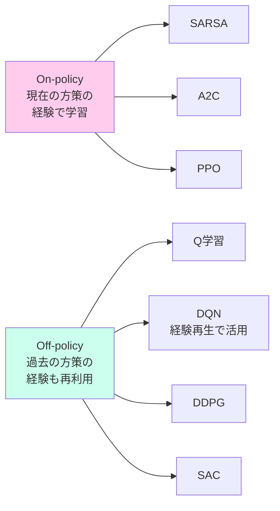

#### DQN の安定化要素

```mermaid
graph TD
    DQN[DQN] --> ER[経験再生<br/>Experience Replay<br/>過去経験をランダム抽出]
    DQN --> TN[ターゲットネットワーク<br/>Target Network<br/>遅延コピーで安定化]
    DQN --> EG[ε-greedy探索<br/>確率εでランダム行動]

    ER -.効果.-> ERF[サンプル相関を低減]
    TN -.効果.-> TNF[Q値推定の発散防止]
    EG -.効果.-> EGF[探索と活用のバランス]

    style ER fill:#cfe
    style TN fill:#fce
    style EG fill:#fec
```

#### sim2real とドメインランダマイゼーション

```mermaid
graph LR
    Sim[シミュレーション環境<br/>方策を学習] --> Real[実世界]
    Sim -.課題.-> OF[シミュ環境への過学習]

    DR[ドメインランダマイゼーション<br/>環境パラメータを<br/>ランダムに変更] --> Sim
    DR -.効果.-> Robust[多様な環境で頑健]

    style Sim fill:#fec
    style Real fill:#cfe
    style OF fill:#fcc
    style DR fill:#fce
```

#### AlphaGo 系列の発展

```mermaid
graph LR
    AG[AlphaGo<br/>2016<br/>李世乭に勝利] --> AGZ[AlphaGo Zero<br/>2017<br/>完全自己対局]
    AGZ --> AZ[AlphaZero<br/>2017<br/>囲碁/将棋/チェス]
    AZ --> MZ[MuZero<br/>2019<br/>環境モデルも学習]

    AG -.特徴.-> Hum[人間棋譜が必要]
    AGZ -.特徴.-> Self[自己対局のみ]
    AZ -.特徴.-> Multi[複数ゲーム汎化]
    MZ -.特徴.-> Model[モデルベース]

    style AG fill:#fec
    style AZ fill:#cfe
    style MZ fill:#fce
```

---

## 4-6 モデルの説明と解釈

#### 解釈手法の分類（粒度 × 対象）

```mermaid
graph TD
    XAI[モデル解釈XAI] --> Scope{粒度?}

    Scope --> Global[大局的説明<br/>Global<br/>モデル全体の傾向]
    Scope --> Local[局所的説明<br/>Local<br/>個別予測の根拠]

    Global --> PI[Permutation Importance]
    Global --> PDP[PDP]
    Global --> ALE[ALE]

    Local --> Grad[Grad-CAM<br/>CNN特化]
    Local --> LIME[LIME<br/>モデル不問]
    Local --> SHAP[SHAP<br/>シャープレイ値]
    Local --> CF[Counterfactual<br/>反実仮想]

    style Global fill:#cfe
    style Local fill:#fce
```
