# 6-図解集

[← 本文に戻る](6-法規制・倫理ガイドライン・社会問題.md)

---

## 6-1 個人情報の構造

#### 個人情報の3層構造

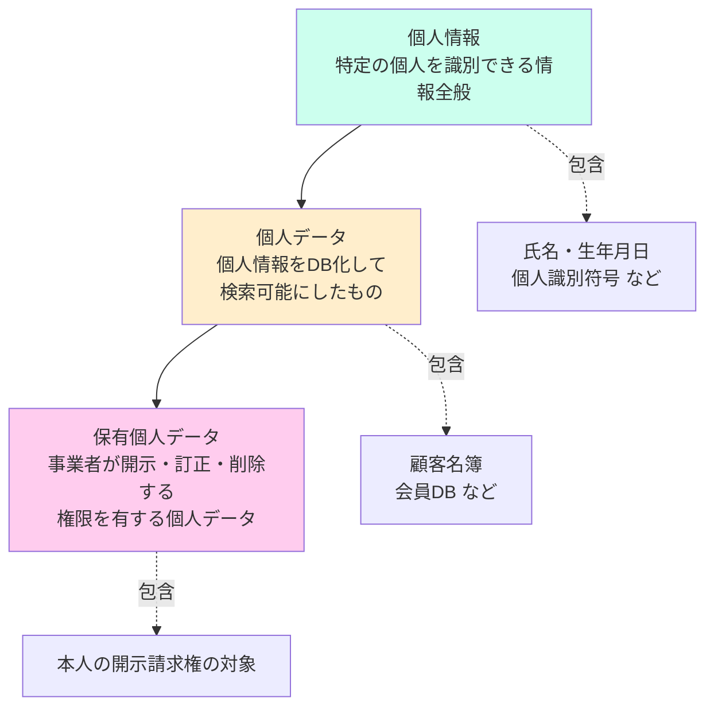

#### 個人情報の加工レベル

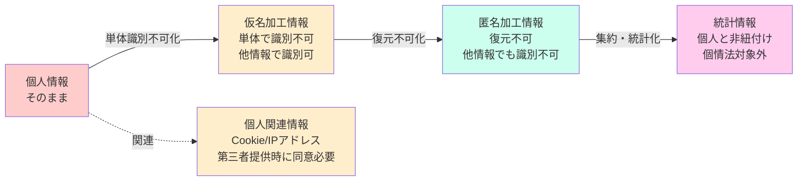

#### 第三者提供のオプトイン／オプトアウト

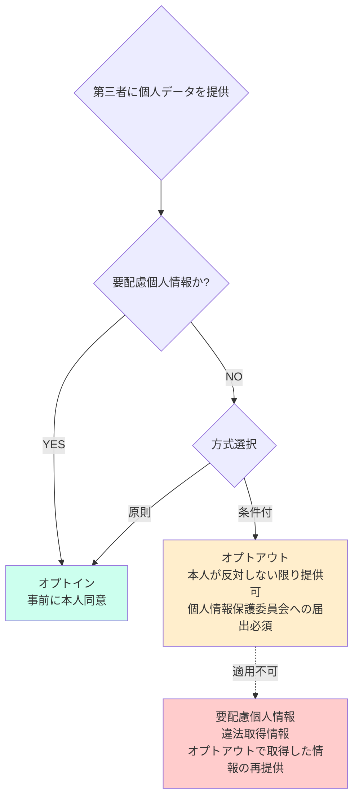

---

## 6-2 知的財産権の全体構造

#### 知的財産権の分類

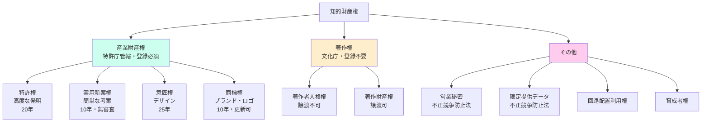

#### 著作権の構造（人格権 vs 財産権）

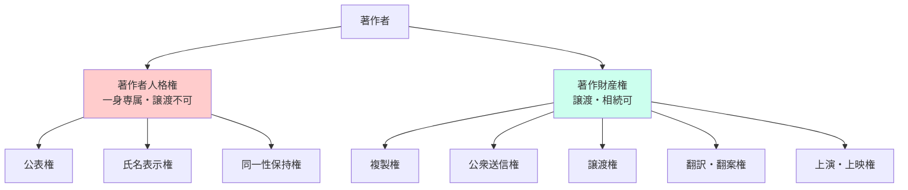

#### AIと著作権（学習段階 vs 出力段階）

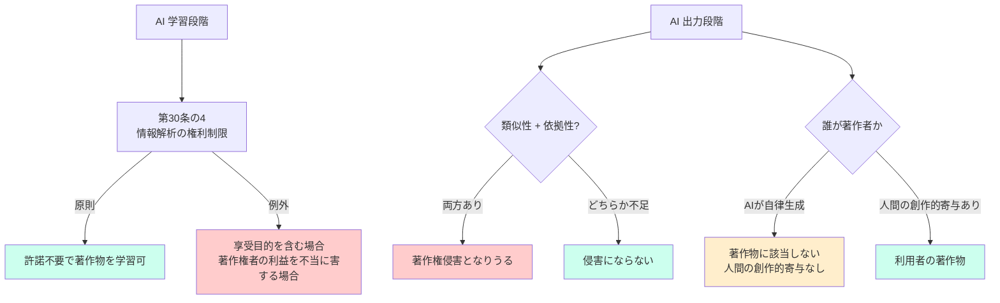

#### 著作権侵害の2要件

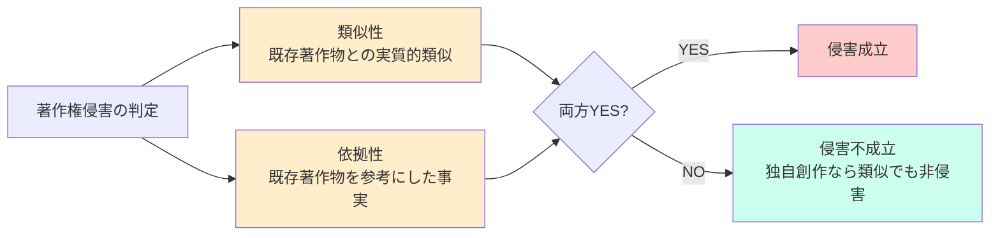

#### 「著作物とは」 — 該当する例 / しない例

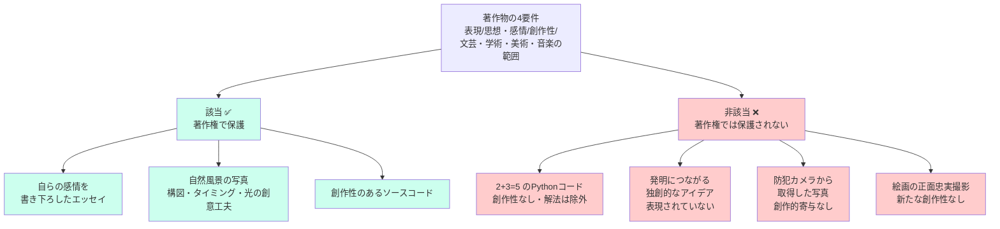

#### AIプロダクトの構成要素 — どこに著作権が発生するか

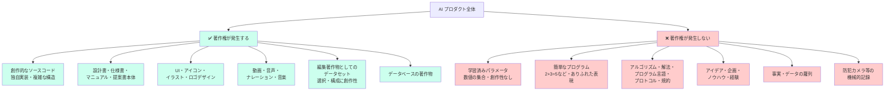

#### AIプロダクト要素 — どの法律で守るか（保護方法マップ）

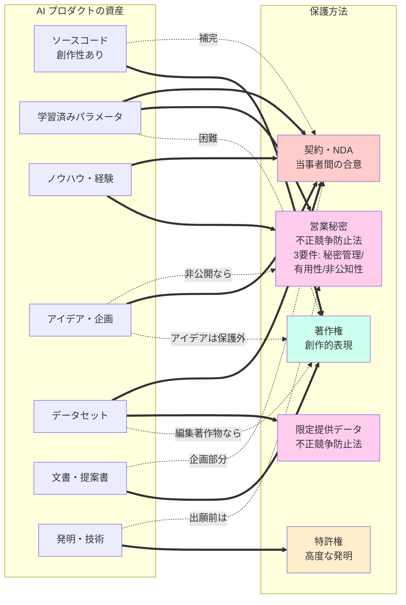

#### 写真の著作権 — ケース別判定

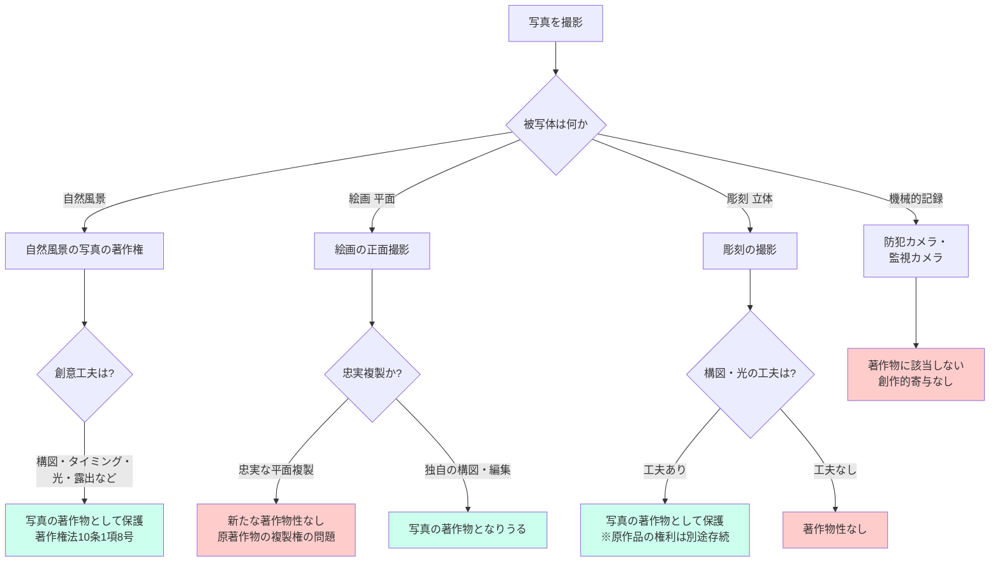

#### AI契約・帰属の整理（経産省「AI・データの利用に関する契約ガイドライン」）

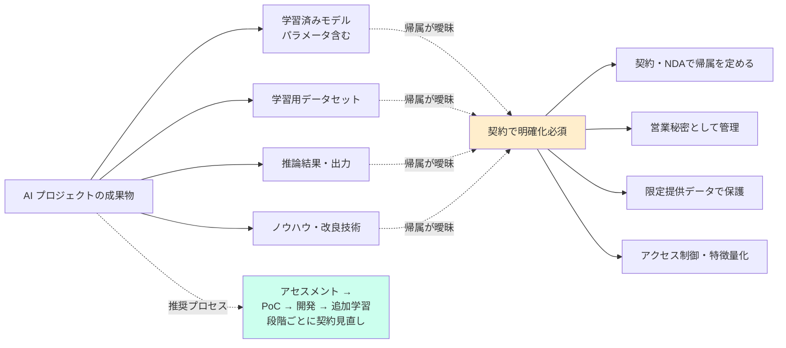

---

## 6-3 特許権

#### 特許の3要件

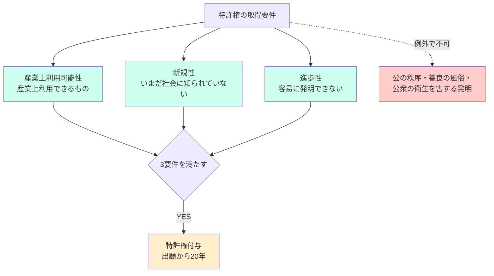

#### 通常実施権 vs 専用実施権

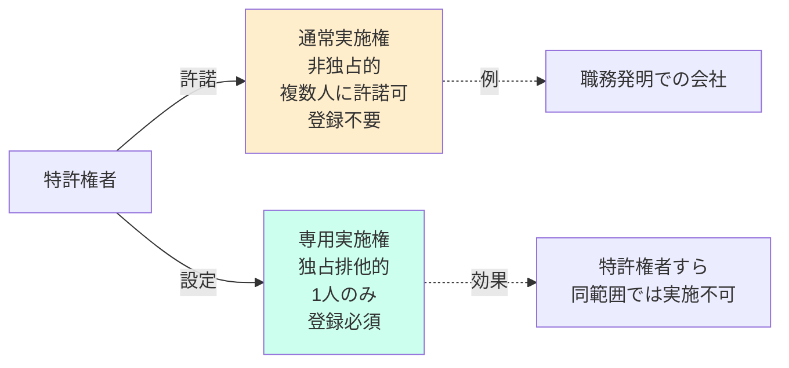

#### 知的財産権4種の対比

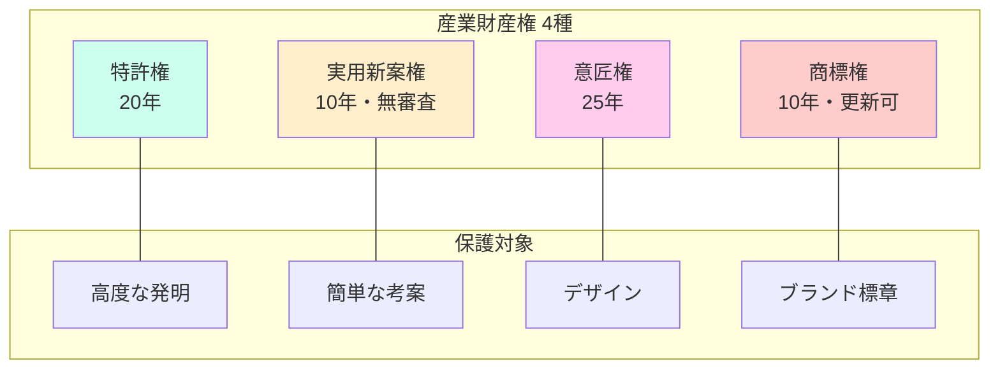

---

## 6-4 不正競争防止法

#### 営業秘密の3要件

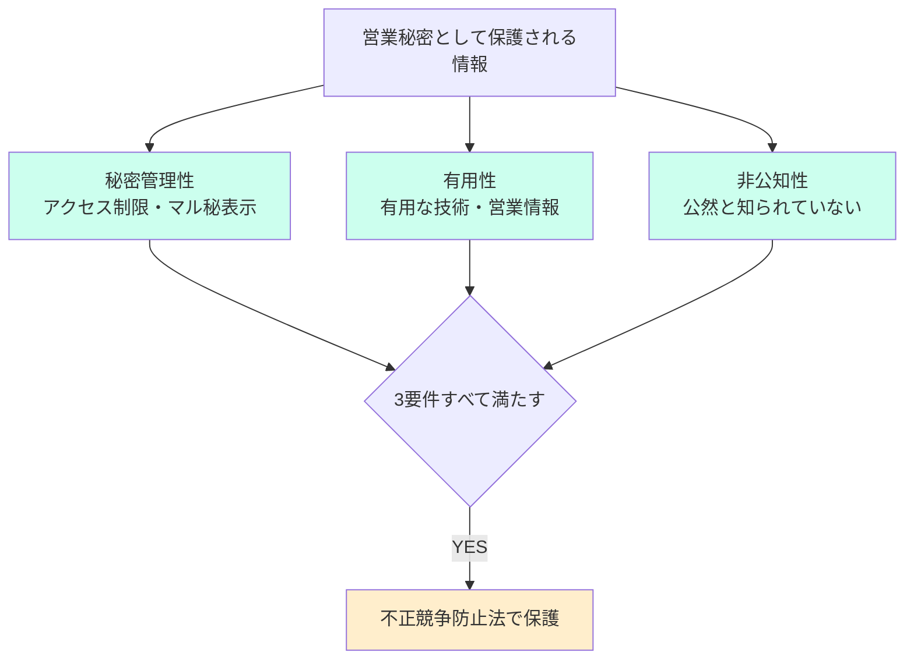

#### 限定提供データの3要件

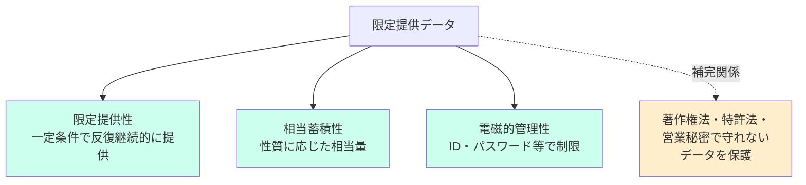

---

## 6-5 データ倫理・AIへの攻撃

#### 研究不正の3類型（FFP）

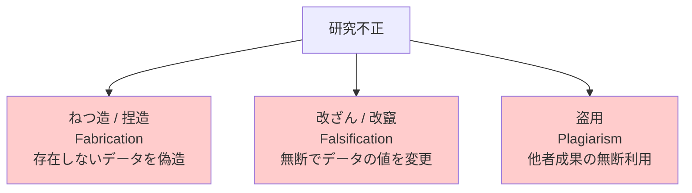

#### AIへの攻撃手法の分類

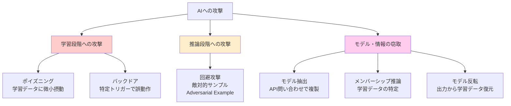

---

## 6-6 説明可能 AI（XAI）

#### XAI 手法の分類

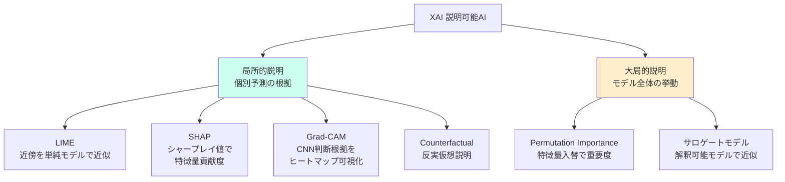

---

## 6-7 AI 倫理ガイドラインと国際動向

#### 日本のAIガイドラインの統合（2024）

```mermaid
graph LR
    subgraph Old [旧 3 ガイドライン]
        O1[AI開発ガイドライン<br/>総務省 2017]
        O2[AI利活用ガイドライン<br/>総務省 2019]
        O3[AI原則実践のための<br/>ガバナンス・ガイドライン<br/>経産省 2022]
    end
    subgraph New [新統合]
        N[AI事業者ガイドライン<br/>経産省・総務省<br/>2024年4月]
    end
    O1 --> N
    O2 --> N
    O3 --> N

    style Old fill:#fec
    style New fill:#cfe
```

#### 主要な国際ガイドライン年表

```mermaid
timeline
    title AI 倫理・規制の国際的潮流
    2016 : Partnership on AI 設立<br/>米IT各社による非営利団体
    2017 : アシロマAI原則<br/>FLI主催・23原則
    2018 : AI at Google our principles<br/>Google AI 原則
    2019 : OECD AI 原則<br/>政府間で初の AI 原則
       : 人間中心のAI社会原則<br/>日本・内閣府
    2022 : AI原則実践のためのガバナンス・GL<br/>経産省
    2023 : G7 広島AIプロセス<br/>生成AI国際指針
       : 中国 生成AI管理弁法
       : 米国 AI 大統領令
       : NIST AI RMF
    2024 : AI事業者ガイドライン<br/>日本・3GL統合
       : EU AI Act 採択<br/>世界初の包括的AI規制法
```

#### ハードロー vs ソフトロー

```mermaid
graph LR
    subgraph Hard [ハードロー・法的拘束力あり]
        H1[個人情報保護法]
        H2[著作権法]
        H3[不正競争防止法]
        H4[独占禁止法]
        H5[GDPR]
        H6[EU AI Act]
    end
    subgraph Soft [ソフトロー・努力義務]
        S1[AI事業者ガイドライン]
        S2[アシロマAI原則]
        S3[OECD AI 原則]
        S4[G7 広島AIプロセス]
        S5[人間中心のAI社会原則]
    end

    Hard -. 違反時 .-> Penalty[刑事罰・損害賠償]
    Soft -. 性質 .-> Voluntary[自主規制・推奨事項]

    style Hard fill:#fcc
    style Soft fill:#fec
```

---

## 6-8 EU AI Act の4リスク区分

```mermaid
graph TD
    Act[EU AI Act<br/>リスクベース・アプローチ]

    Act --> R1[許容できないリスク<br/>Unacceptable Risk]
    Act --> R2[ハイリスク<br/>High Risk]
    Act --> R3[限定リスク<br/>Limited Risk]
    Act --> R4[最小リスク<br/>Minimal Risk]

    R1 -->|規制| RR1[禁止]
    R2 -->|規制| RR2[適合性評価<br/>事前審査・登録義務]
    R3 -->|規制| RR3[透明性義務<br/>AI使用の明示]
    R4 -->|規制| RR4[自由<br/>自主行動規範推奨]

    R1 -.例.-> E1[ソーシャルスコアリング<br/>サブリミナル操作<br/>公共空間での生体認証]
    R2 -.例.-> E2[医療診断・採用・教育<br/>司法・重要インフラ]
    R3 -.例.-> E3[チャットボット<br/>ディープフェイク]
    R4 -.例.-> E4[スパムフィルタ<br/>ゲームAI]

    style R1 fill:#fcc
    style R2 fill:#fec
    style R3 fill:#fce
    style R4 fill:#cfe
```

---

## 6-9 GDPR の主要権利と適用

#### GDPR の域外適用

```mermaid
graph TD
    Subject[EU域内のデータ主体]
    Comp1[EU域内の事業者] -->|当然適用| Subject
    Comp2[EU域外の事業者] -->|商品・サービス提供 or<br/>行動監視で適用| Subject

    Subject --> Rights[GDPR で保証される権利]
    Rights --> R1[アクセス権]
    Rights --> R2[訂正権]
    Rights --> R3[削除権<br/>忘れられる権利]
    Rights --> R4[データポータビリティ権]
    Rights --> R5[プロファイリング異議申立権]

    Comp2 -.> Cross[越境移転の可否]
    Cross --> Adequacy[十分性認定<br/>日本は2019年取得]
    Cross --> SCC[標準契約条項 SCC]
    Cross --> Consent[本人同意]

    style Subject fill:#cfe
    style Rights fill:#fec
    style Cross fill:#fce
```

---

## 6-10 独占禁止法・デジタルカルテル

```mermaid
graph TD
    AntiTrust[独占禁止法]
    AntiTrust --> Cartel[不当な取引制限<br/>カルテル<br/>事業者間で価格合意]
    AntiTrust --> Monopoly[私的独占<br/>他社の事業活動を排除]

    AntiTrust -. AI による違反 .-> Digital[デジタルカルテル]

    Digital --> Monitor[監視アルゴリズム<br/>合意通りの価格遵守を<br/>AIで監視・市場支配]
    Digital --> Parallel[パラレルアルゴリズム<br/>事業者間で同じAIを共有<br/>合意通り価格付け]

    AntiTrust -. 関連 .-> DataMon[データ寡占<br/>少数事業者によるデータ独占]

    style Cartel fill:#fcc
    style Monopoly fill:#fcc
    style Digital fill:#fec
    style DataMon fill:#fce
```

---

## 6-11 社会実装の課題

#### 情報の偏り（フィルターバブル vs エコーチェンバー）

```mermaid
graph LR
    subgraph FB [フィルターバブル]
        F1[アルゴリズムによる<br/>パーソナライズ]
        F2[ユーザの嗜好に<br/>合う情報だけ表示]
        F1 --> F2
    end

    subgraph EC [エコーチェンバー]
        E1[ユーザ自身の選択]
        E2[似た意見の人だけ<br/>フォロー]
        E3[同質の意見が反響]
        E1 --> E2 --> E3
    end

    FB -. 原因 .-> Cause1[アルゴリズム]
    EC -. 原因 .-> Cause2[自己選択]

    style FB fill:#fec
    style EC fill:#fce
    style Cause1 fill:#cfe
    style Cause2 fill:#cfe
```

#### LAWS と国際的議論

```mermaid
graph TD
    LAWS[LAWS<br/>自律型致死兵器システム]
    LAWS --> Def[人間の判断を介さず<br/>AI 自身の判断で攻撃]

    LAWS --> Intl[国連 CCW<br/>特定通常兵器使用禁止<br/>制限条約で議論]

    LAWS --> JP[日本政府の立場]
    JP --> JP1[LAWS の開発はしない]
    JP --> JP2[人の意思が介在する<br/>自律型兵器の研究は規制せず]

    LAWS --> Google[AI at Google<br/>2018年・兵器目的では<br/>AIを開発しない宣言]

    style LAWS fill:#fcc
    style JP fill:#fec
    style Google fill:#cfe
```

#### AI の社会的課題マップ

```mermaid
graph TD
    Issues[AI の社会的課題]

    Issues --> Info[情報・認知]
    Issues --> Bias[バイアス・差別]
    Issues --> Sec[安全保障・倫理]
    Issues --> Emp[雇用・社会構造]
    Issues --> Acc[アクセシビリティ]

    Info --> I1[フィルターバブル]
    Info --> I2[エコーチェンバー]
    Info --> I3[ハルシネーション]
    Info --> I4[ディープフェイク]
    Info --> I5[ダークパターン]

    Bias --> B1[アルゴリズミック・バイアス]
    Bias --> B2[データバイアス]

    Sec --> S1[LAWS]
    Sec --> S2[トロッコ問題]

    Emp --> E1[テクノロジー失業]
    Emp --> E2[デジタルデバイド]

    Acc --> A1[インクルーシブAI]

    style Info fill:#fec
    style Bias fill:#fcc
    style Sec fill:#fcc
    style Emp fill:#fce
    style Acc fill:#cfe
```

---

[← 本文に戻る](6-法規制・倫理ガイドライン・社会問題.md)
